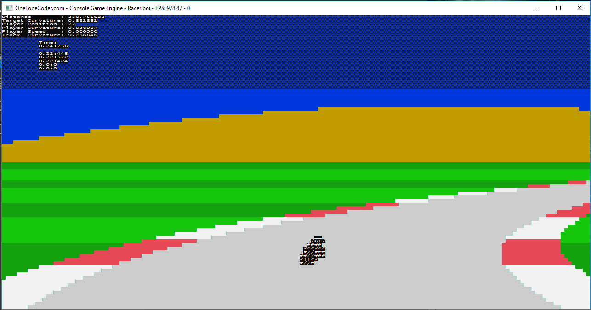

# arcaderacer
My implementation of a retro racer by OneLoneCoder.com

### How to compile it

As I didn't care to register an account at Visual Studio; so this code is made so that it compiles using the 
MinGW64 tools using the C++17 standard. You can use those tools together with the free Visual Studio Code editor.

- [MinGW64](https://mingw-w64.org/doku.php)
- [Visual Studio Code](https://code.visualstudio.com/)

All thanks goes to Javidx9 @ OneLoneCoder.com, for making those awesome videos.

### Screenshots

